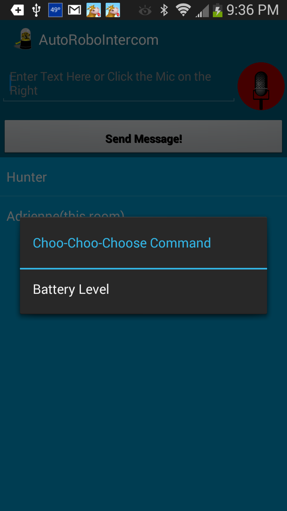

AutoRoboIntercom 
Initial Commit Hunter Davis March 2014, Last Commit Mid-March 2014

Just a quick auto-discovery intercom system using text-to-speech and speech-to-text.  

I've recently updated to include the start of a remote command protocol, and the first client-specific option 'battery'.  So you can use this as a battery level monitor for all connected clients.

Notes:
1. 
 I will likely update to include actual audio or video streams at some point.

2. 
 If your Android device is running JellyBean or above:
 Go to Settings -> Language & Input -> Voice Search and download the offline speech recognition pack.

3. 
 This will also likely serve as my 'quick and dirty' across-android-device communications backchannel for future articles on www.hunterdavis.com 

